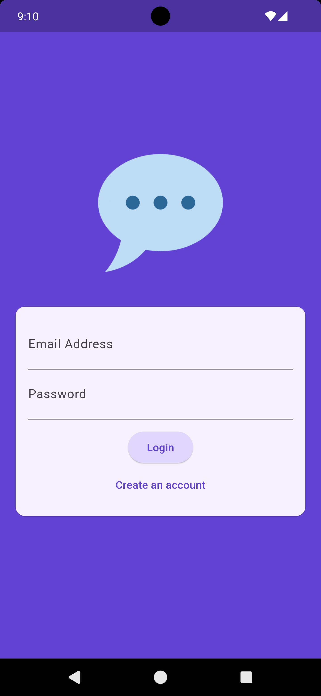
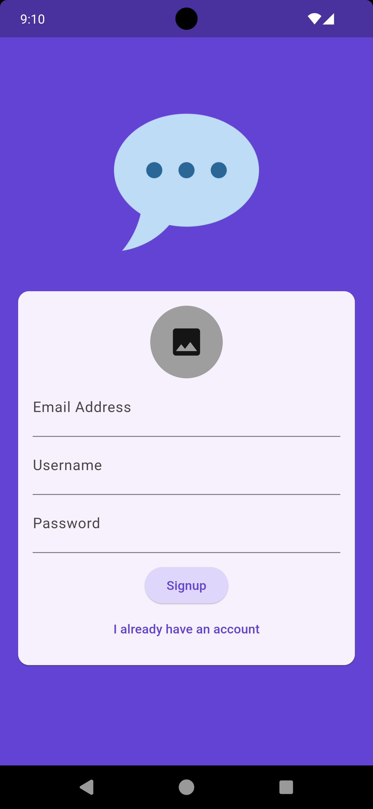
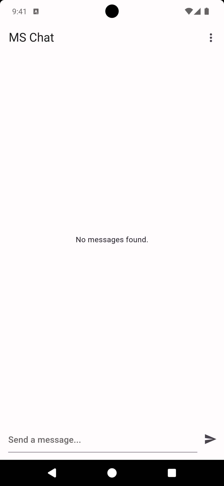
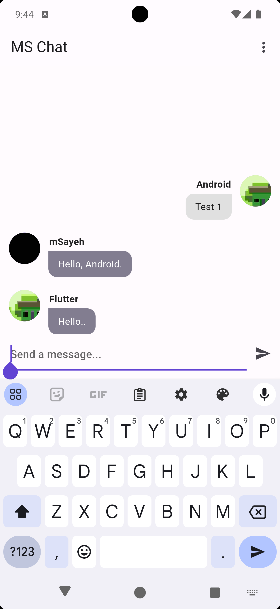

# MS Chat

MS Chat is a Flutter-based chat application that provides a simple and efficient platform for real-time messaging with authentication using Firebase. The app supports a single public chat room where users can log in, sign up, and exchange messages.

## Screenshots

  
  
  
  

## Features

- **Firebase Authentication:** Users can create an account or log in using their email address and password.
- **Firestore Integration:** Messages are stored and retrieved in real-time from Firestore.
- **Real-time Messaging:** Utilizes Firestore Streams to update messages in real-time.
- **User Interface:** Simple and user-friendly UI for seamless chatting experience.

## How to Use

1. **Sign Up:**
    - Navigate to the "Create an account" screen.
    - Fill in your email address, username, and password.
    - Optionally, you can upload a profile picture from the camera or gallery.

2. **Login:**
    - Enter your email address and password on the login screen.
    - Click the "Login" button to access the chat room.

3. **Chat:**
    - Once logged in, you can start sending and receiving messages in the public chat room.
    - Messages are updated in real-time, ensuring a smooth communication experience.

## Technologies Used

- **Flutter:** Frontend framework for building the app.
- **Firebase Authentication:** For user authentication and management.
- **Firestore:** For storing and streaming chat messages.
- **Streams:** For real-time updates of messages.

## How It Works
1. **User Authentication:**
   * Users can sign up or log in using their email and password.
   * Firebase Authentication handles the authentication process.
2. **Public Chat Room:**
   * Once authenticated, users can access the public chat room.
   * Messages are stored in Firestore and are displayed in real-time using Streams.
3. **User Profiles:**
   * During registration, users can upload a profile picture.
   * Profile pictures are displayed next to the messages in the chat room.
